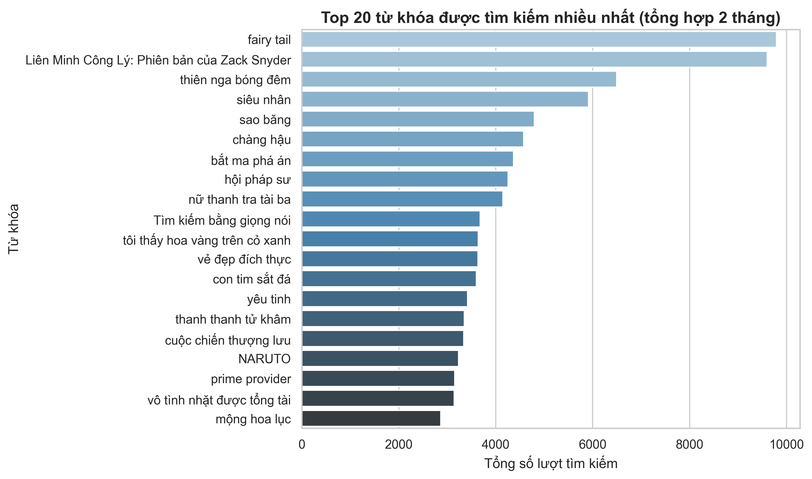
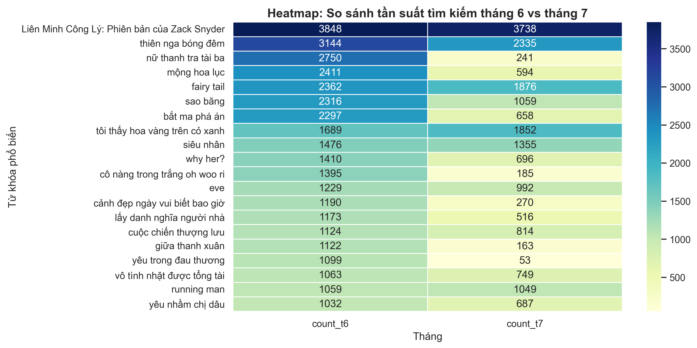
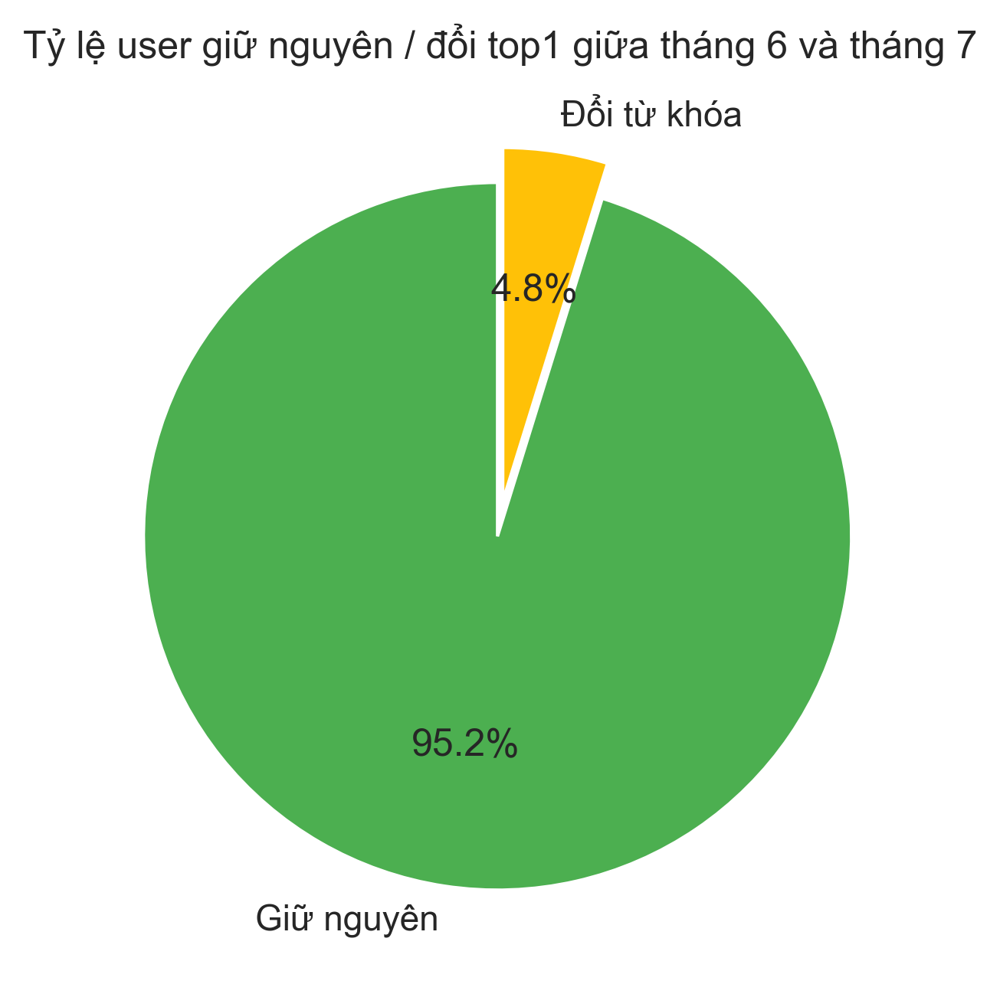
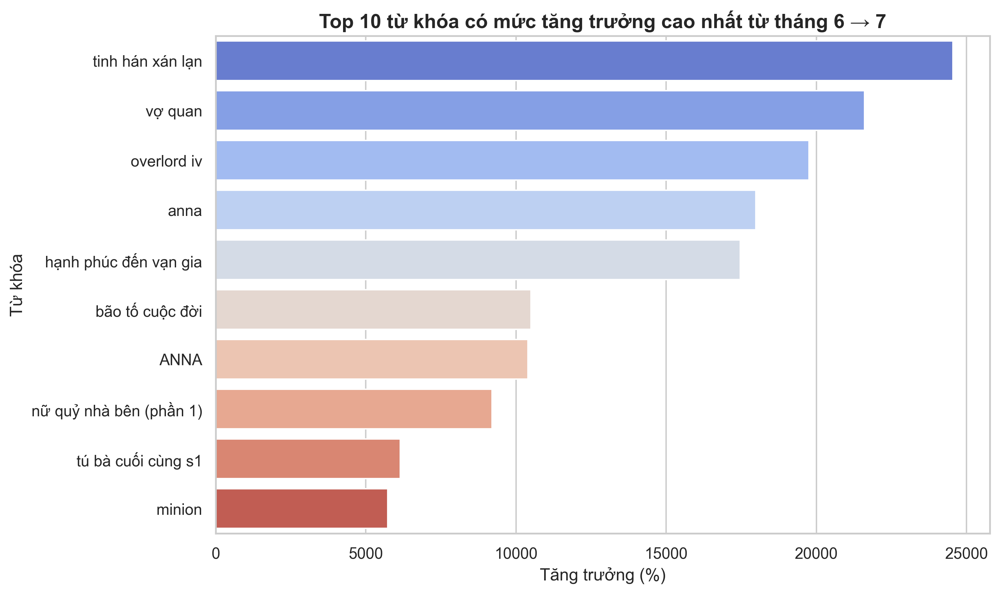
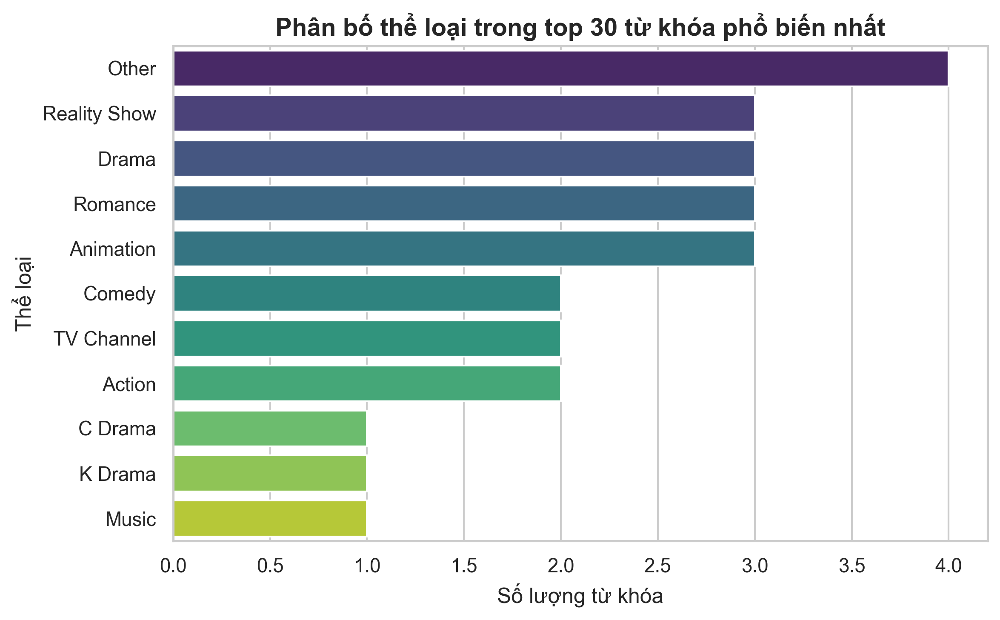
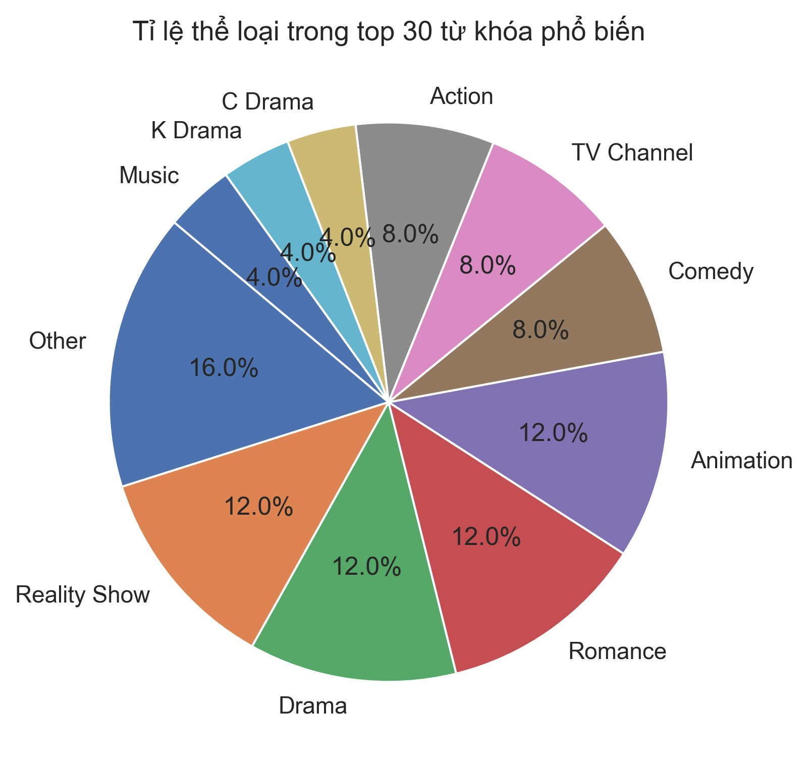

# User Search Log Analysis – ETL + AI Classification + EDA Visualization

## Tổng quan Project

Project kết hợp **ETL pipeline**, **AI classification** và **EDA visualization** để xử lý và phân tích dữ liệu log tìm kiếm người dùng.

---

## Mục tiêu chính

1. **Phân tích hành vi người dùng**

   - Theo dõi các từ khóa người dùng tìm kiếm.
   - Nhận diện các thể loại nội dung mà người dùng quan tâm (phim, show, thể thao, hoạt hình…).

2. **Xử lý dữ liệu lớn & ETL**

   - Đọc dữ liệu parquet nhiều thư mục, làm sạch dữ liệu thiếu, chuẩn hóa cột.
   - Tính toán top keyword theo từng user, theo tháng (ví dụ tháng 6, tháng 7).
   - Xuất dữ liệu ra CSV phục vụ báo cáo hoặc dashboard.

3. **AI Keyword Classification**

   - Chuẩn hóa tên từ khóa (thêm dấu, tách từ, sửa lỗi chính tả).
   - Gán thể loại phù hợp nhất dựa trên danh sách thể loại predefined (Action, Romance, Comedy, Drama, K/C Drama, Animation, Reality Show…).
   - Giúp phân tích chính xác sở thích người dùng, hỗ trợ recommendation system hoặc marketing.

4. **Phân tích & Trực quan hóa (EDA)**
   - Khám phá và minh họa xu hướng tìm kiếm giữa **tháng 6 và tháng 7**.
   - Phân tích **mức độ thay đổi độ phổ biến** của từng từ khóa.
   - So sánh **tỷ lệ người dùng giữ nguyên top1 keyword** giữa hai tháng.
   - Thống kê **phân bố thể loại** trong top keyword phổ biến.

---

## Quy trình xử lý dữ liệu (Workflow chi tiết)

Toàn bộ pipeline được chia thành 4 giai đoạn chính:  
**Data Ingestion → Data Cleaning & Transformation → AI Keyword Classification → EDA & Visualization**

---

### 1️⃣ **Data Ingestion**

- **Mục tiêu:** đọc và hợp nhất dữ liệu log tìm kiếm từ nhiều thư mục, định dạng `.parquet`.
- **Công cụ:** sử dụng **PySpark** để xử lý dữ liệu lớn hiệu quả.
- **Nguồn dữ liệu:** thư mục `log_search/`, mỗi tệp tương ứng với một phần log tìm kiếm trong tháng.
- **Dữ liệu thô chứa**: `eventID, datetime, user_id, keyword, category, platform, networkType, userPlansMap`.

---

### 2️⃣ **Data Cleaning & Transformation**

- **Mục tiêu:** chuẩn hóa và tạo dataset phân tích theo tháng.
- **Các bước thực hiện:**
  - Loại bỏ các dòng có giá trị **rỗng hoặc NULL** trong cột `keyword`.
  - Chuẩn hóa text (xóa khoảng trắng thừa, chữ thường, ký tự đặc biệt...).
  - Sinh cột **`month`** bằng cách trích xuất tháng từ `datetime`.
  - Tính toán **top keyword của mỗi user theo từng tháng**:
    - `top1_keywords` → từ khóa phổ biến nhất của từng user/tháng.
    - `top3_keywords` → ba từ khóa được tìm kiếm nhiều nhất.
  - Lưu kết quả trung gian ra thư mục:
    - `outputs/top_keyword_by_month/`
    - `outputs/top1_keywords/`
    - `outputs/top3_keywords/`

---

### 3️⃣ **AI Keyword Classification**

- **Mục tiêu:** gán **thể loại nội dung** phù hợp cho các từ khóa phổ biến, giúp hiểu rõ hơn hành vi người dùng.
- **Công cụ:** script `ai_keyword_classifier.py` gọi **OpenRouter API (free tier)** để thực hiện phân loại tự động.
- **Quy trình:**
  1. Lấy **top 30 từ khóa phổ biến nhất** từ dữ liệu tổng hợp.
  2. Gửi từng từ khóa đến API để gán **thể loại phù hợp nhất**, ví dụ:
     - `Action`, `Romance`, `Comedy`, `Drama`, `K-Drama`, `C-Drama`, `Animation`, `Reality Show`, `Sports`, `TV Channel`, `News`, `Other`…
  3. Nhận phản hồi JSON dạng:
     ```json
     {
       "NARUTO": "Animation",
       "Running Man": "Reality Show",
       "The Heirs": "K-Drama"
     }
     ```
  4. Xuất kết quả:
     - **CSV:** `outputs/keyword_classified_top30.csv`
     - **JSON:** lưu tạm trong quá trình chạy để kiểm tra nhanh.
- **Lưu ý:**  
  Do dùng **OpenRouter free API**, hệ thống chỉ test trên **30 từ khóa phổ biến nhất** để đảm bảo giới hạn request.  
  Nếu có API trả phí → có thể mở rộng sang **toàn bộ từ khóa trong log** để phân loại sâu hơn.

---

### 4️⃣ **EDA & Visualization**

- **Mục tiêu:** trực quan hóa kết quả ETL & AI classification để phân tích xu hướng tìm kiếm.
- **Thực hiện tại:** file `eda_keywords.ipynb` (hoặc `top_keywords_analysis.py`)
- **Công cụ:** `matplotlib`, `seaborn`, `pandas`
- **Tự động lưu biểu đồ:** thư mục `outputs/charts/` dưới định dạng `.png`.

  **Các biểu đồ chính:**

  - **Top 20 từ khóa phổ biến (tổng hợp 2 tháng)**
  - **Heatmap:** So sánh tần suất tìm kiếm tháng 6 vs tháng 7
  - **User behavior:** So sánh top1 tháng 6 → top1 tháng 7
  - **Xu hướng tìm kiếm tháng 6 và tháng 7**
  - **Phân tích thể loại trong top 30 từ khóa phổ biến**

---

## 📂 Cấu trúc thư mục

```bash
LOG_SEARCH_ETL/
│
├── log_search/ # (dữ liệu gốc)
│
├── outputs/
│ ├── charts/ # Lưu biểu đồ đầu ra (PNG)
│ ├── top_keyword_by_month/ # Top từ khóa theo từng tháng
│ ├── top1_keywords/ # Từ khóa top 1 mỗi tháng
│ └── top3_keywords/ # Top 3 từ khóa mỗi tháng
│ └── keyword_classified_top30.csv # 30 từ khóa phổ biến nhất
│
├── .env # Thông tin môi trường (API key, config)
├── .gitignore # Loại trừ các file không cần commit
│
├── ai_keyword_classifier.py # Script AI phân loại nội dung từ khóa
├── eda_keywords.ipynb # Notebook phân tích khám phá dữ liệu (EDA)
├── ETL_log_search.ipynb
│
├── top_keyword_by_month.py # Tính toán top từ khóa theo tháng
├── top_keywords_analysis.py # Phân tích từ khóa tổng thể
│
└── README.md # Tài liệu mô tả dự án

```

## 📊 Ví dụ biểu đồ

- **Top 20 từ khóa được tìm kiếm nhiều nhất:**
  

- **Heatmap:** So sánh tần suất tìm kiếm tháng 6 vs tháng 7
  

- **User behavior:** So sánh top1 tháng 6 → top1 tháng 7
  

- **Xu hướng tìm kiếm tháng 6 và tháng 7**
  

- **Phân tích thể loại trong top 30 từ khóa phổ biến**
  


