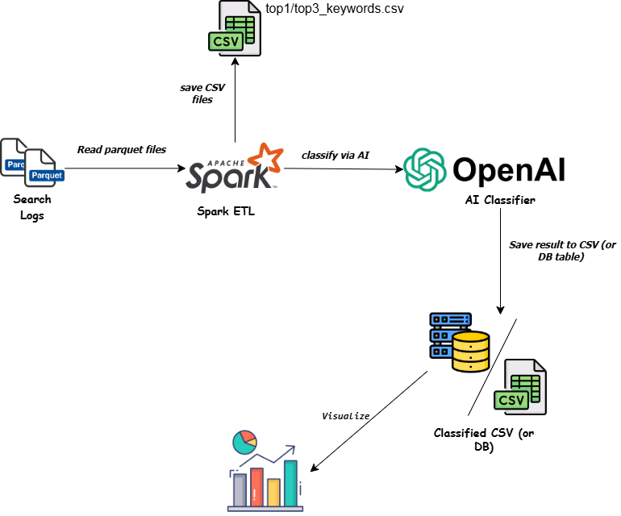
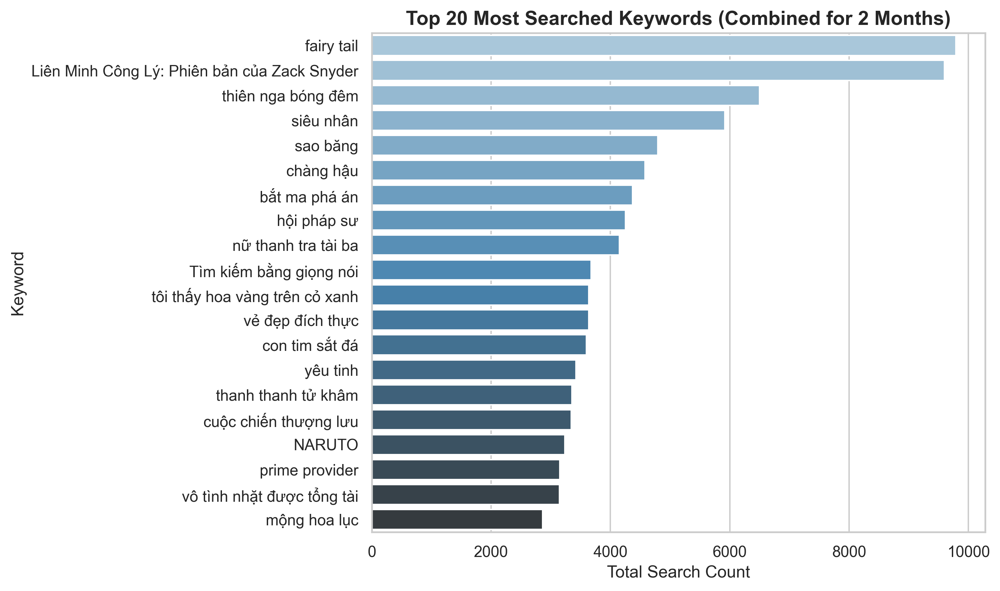
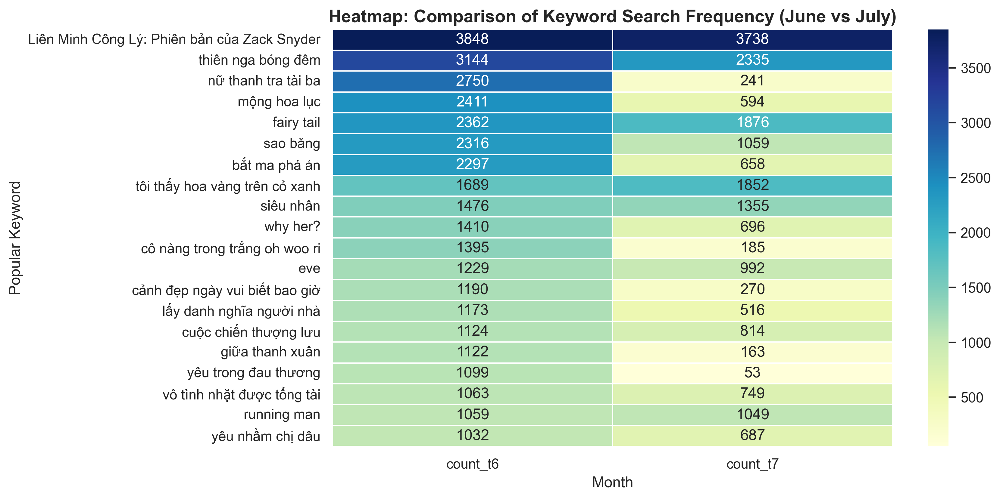
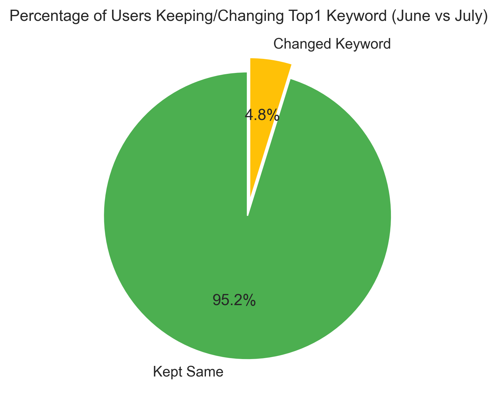
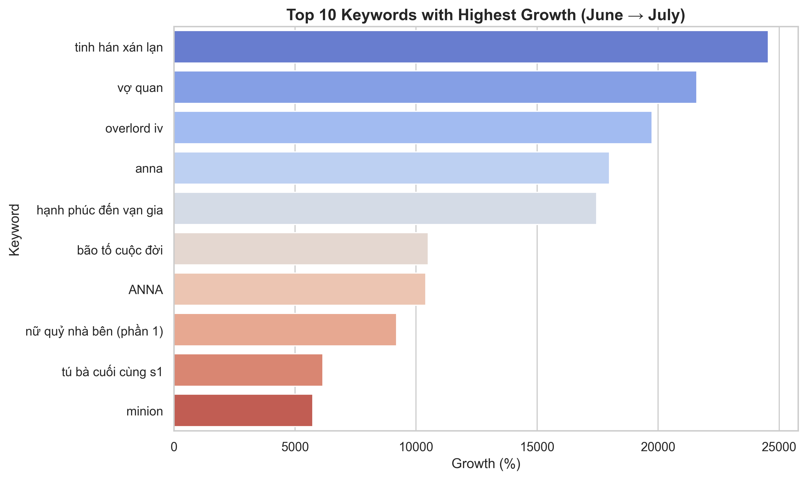
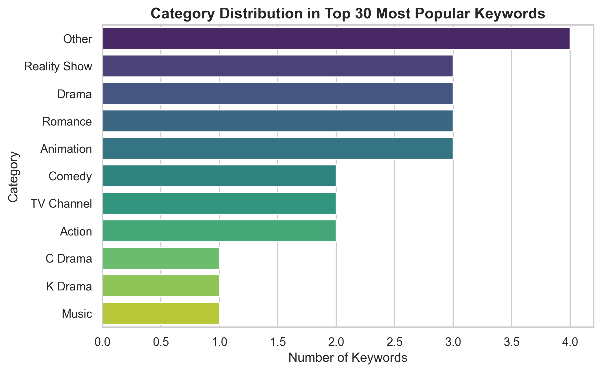
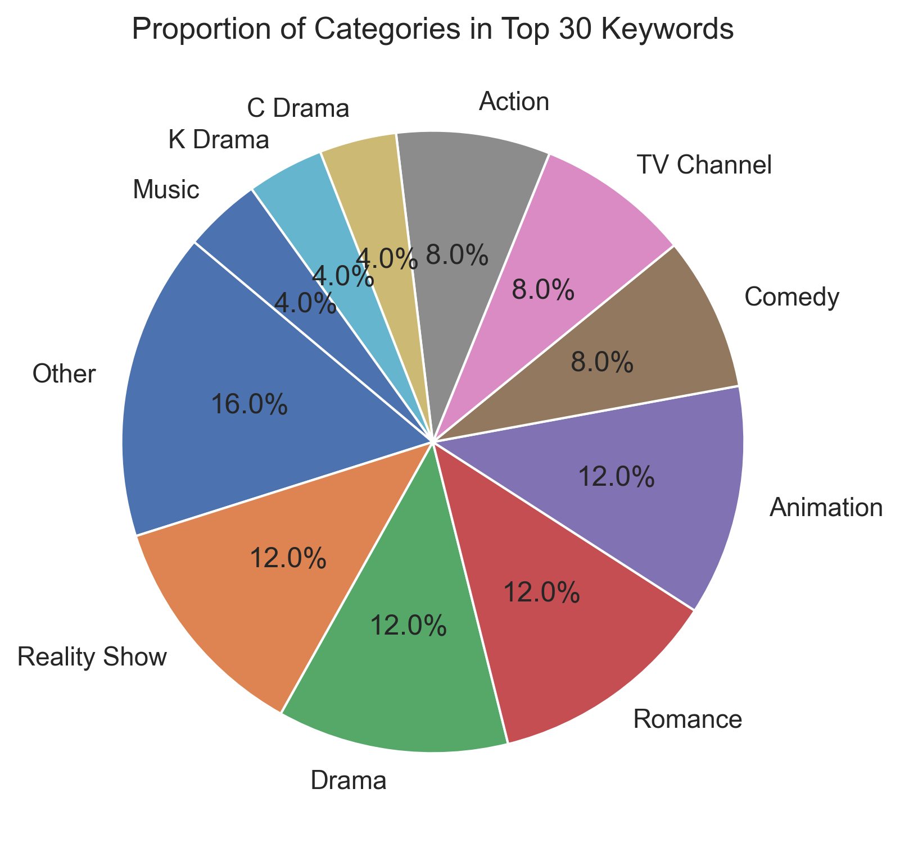

# User Search Log Analysis – ETL + AI Classification + EDA Visualization

## 📝 Project Overview

This project combines **ETL pipelines, AI keyword classification, and EDA visualization** to process and analyze user search log data. The goal is to understand user behavior, identify popular content types, and generate insights for recommendations or marketing.



---

## 📂 Directory Structure

```bash
LOG_SEARCH_ETL/
│
├── log_search/ # raw parquet data
│
├── outputs/
│ ├── charts/ # charts output
│ ├── top_keyword_by_month/ # top keywords by month
│ ├── top1_keywords/ # top 1 keyword per month
│ └── top3_keywords/ # top 3 keywords per month
│ └── keyword_classified_top30.csv
│
├── .env # environment variables (API key, config)
├── .gitignore
│
├── ai_keyword_classifier.py
├── eda_keywords.ipynb
├── ETL_log_search.ipynb
│
├── top_keyword_by_month.py
├── top_keywords_analysis.py
│
└── README.md

```

**📁 Note: About the log_search/ Folder**

The folder log_search/ contains all raw .parquet files used for the ETL and analysis in this project.
However, these files are large and therefore not included in the GitHub repository.

If you want to run the pipeline locally, place your parquet files in:

```bash
  log_search/
      ├── part-0000.parquet
      ├── part-0001.parquet
      └── ...
```

## 🎯 Main Objectives

### 1. Analyze User Behavior

- Track the keywords users search for.

- Identify content types of interest: movies, shows, sports, animation, etc.

### 2. Big Data Processing & ETL

- Read parquet files across multiple directories, clean missing data, and standardize columns.

- Compute top keywords per user per month (e.g., June, July).

- Export intermediate results to CSV for reporting or visualization.

### 3. AI Keyword Classification

- Standardize keyword text (normalize accents, split words, fix typos).

- Assign the most relevant content category based on predefined types:
  Action, Romance, Comedy, Drama, K-Drama, C-Drama, Animation, Reality Show, Sports, TV Channel, News, Other.

- Helps understand user preferences and support recommendation systems.

### 4. Exploratory Data Analysis (EDA) & Visualization

- Explore and visualize trends across June and July.

- Analyze the popularity changes of keywords between months.

- Compare user retention of top1 keyword between months.

- Visualize category distribution in top keywords.

---

## Data Processing Workflow

The entire pipeline consists of **4 main stages**:
**Data Ingestion → Data Cleaning & Transformation → AI Keyword Classification → EDA & Visualization**

### 1️⃣ **Data Ingestion**

- **Goal:** Read and consolidate search log data from multiple .parquet directories.

- **Tool:** PySpark for efficient large-scale data processing.

- **Raw data contains:** eventID, datetime, user_id, keyword, category, platform, networkType, userPlansMap.

```python
  import glob
  from pyspark.sql import SparkSession

  spark = SparkSession.builder.appName("ReadParquet").getOrCreate()

  # Find all .parquet files in the folder
  files = glob.glob(r"D:\study_de\Homework\log_search_etl\log_search\20220601\*.parquet")

  # read all find and uninon
  df = spark.read.parquet(*files)
  df.printSchema()

```

### 2️⃣ **Data Cleaning & Transformation**

2️⃣ Data Cleaning & Transformation

- **Goal:** Standardize data and create monthly analysis datasets.

**Steps:**

1. Remove rows with **null/empty keywords.**

2. Normalize text (trim whitespace, lowercase, remove special chars if needed).

3. Extract `month` from `datetime`.

4. Compute top keywords per user:

`top1_keywords` → most searched keyword per user per month.

`top3_keywords` → top 3 keywords per user per month.

5. Save intermediate results to:
   `outputs/top_keyword_by_month/`, `outputs/top1_keywords/`, `outputs/top3_keywords/`

```python
  def get_top_keyword_by_month(df: DataFrame) -> DataFrame:
    """
     Get top 1 keyword per user_id and per month, then pivot into separate columns.
    """
       # Convert datetime to date and extract month
    df_with_month = df.withColumn("date", to_date("datetime")) \
                      .withColumn("month", month("date"))


      # Count keyword searches per user per month
    keyword_count = (
        df_with_month.groupBy("user_id", "month", "keyword")
                     .agg(count("*").alias("search_count"))
    )

   # Window specification per user + month
    windowSpec = Window.partitionBy("user_id", "month").orderBy(col("search_count").desc())

    # Rank and filter top keyword
    top_keywords = (
        keyword_count.withColumn("rank", row_number().over(windowSpec))
                     .filter(col("rank") == 1)
                     .select("user_id", "month", "keyword", "search_count")
    )

    # Pivot to get columns most_search_t6, most_search_t7
    pivot_df = top_keywords.groupBy("user_id").pivot("month", [6, 7]) \
                           .agg(first("keyword").alias("most_search"))

     # Rename columns for clarity
    pivot_df = pivot_df.withColumnRenamed("6", "most_search_t6") \
                       .withColumnRenamed("7", "most_search_t7")

    return pivot_df
```

**Note:** In production, these would ideally be written to a database (PostgreSQL, MySQL, or NoSQL). For this project:

- Saving as CSV allows easy sharing on GitHub.

- Your EDA scripts read CSVs to generate charts.

### 3️⃣ **AI Keyword Classification**

- **Goal:** Assign content categories for top keywords to better understand user interests.

- **Tool:** ai_keyword_classifier.py using OpenRouter API (free tier).

- **Process:**

  1. Select top 30 keywords from aggregated data.

  2. Send keywords to API → receive category predictions:
     - `Action`, `Romance`, `Comedy`, `Drama`, `K-Drama`, `C-Drama`, `Animation`, `Reality Show`, `Sports`, `TV Channel`, `News`, `Other`…
  3. Receive category predictions:
     ```json
     {
       "NARUTO": "Animation",
       "Running Man": "Reality Show",
       "The Heirs": "K-Drama"
     }
     ```
  4. Export results:
     - **CSV:** `outputs/keyword_classified_top30.csv`
     - **JSON:** (optional for quick checking).

```python

# --- 4. Classify keywords via API ---
def classify_keywords(keywords, retries=3):
    """
    Gửi danh sách keywords cho model GPT để phân loại.
    Trả về dict {keyword: category}
    """
    movie_list = json.dumps(keywords, ensure_ascii=False)

    prompt = f"""
    Bạn là chuyên gia phân loại nội dung phim, chương trình truyền hình và các loại nội dung giải trí.

     Nguyên tắc quan trọng:
    - Không được trả về "Other" nếu có thể đoán được dù chỉ một phần ý nghĩa.
    - Luôn cố gắng sửa lỗi, nhận diện tên gần đúng hoặc đoán thể loại gần đúng.
    - Nếu không chắc → chọn thể loại gần nhất (VD: từ mô tả tình cảm → Romance, tên địa danh thể thao → Sports, chương trình giải trí → Reality Show, v.v.)

     Nhiệm vụ:
    1. **Chuẩn hoá tên**: thêm dấu tiếng Việt nếu cần, tách từ, chỉnh chính tả (vd: "thuyếtminh" → "Thuyết minh", "tramnamu" → "Trăm năm hữu duyên", "capdoi" → "Cặp đôi").
    2. **Nhận diện ý nghĩa gốc**:
        - Có thể là tên phim, show, series, đội tuyển, quốc gia, nhân vật, hay mô tả thể loại nội dung.
        - Nếu không rõ ràng, chọn thể loại gần nhất.
    3. **Gán thể loại phù hợp nhất** trong các nhóm:
        - Action
        - Romance
        - Comedy
        - Horror
        - Animation
        - Drama
        - C Drama
        - K Drama
        - Sports
        - Music
        - Reality Show
        - TV Channel
        - News
        - Other

       Một số quy tắc gợi ý nhanh:
    - Có từ “VTV”, “HTV”, “Channel” → TV Channel
    - Có “running”, “master key”, “reality”, “idol”, “show”, “challenge” → Reality Show
    - Quốc gia, CLB bóng đá, sự kiện thể thao → Sports hoặc News
    - Có từ “romantic”, “love”, “kiss” → Romance
    - Có “potter”, “hogwarts”, “wizard”, “magic” → Drama / Fantasy
    - Tên phim, diễn viên, hoặc series Trung Quốc → C Drama
    - Tên phim, diễn viên, hoặc series Hàn Quốc → K Drama
    - Tên hoạt hình, nhân vật anime → Animation
    - Các từ mô tả hành động, chiến đấu (“fight”, “gun”, “hero”, “war”) → Action
    - Các cụm từ mang tính tin tức (“breaking”, “live”, “news”) → News
    - Nếu chỉ là cụm chung chung (“video”, “clip”, “xem phim”) → Other

     Chỉ trả về **1 JSON object**.
    - Key = tên gốc trong danh sách.
    - Value = thể loại đã phân loại.

    Ví dụ:
    {{
      "thuyếtminh": "Other",
      "bigfoot": "Horror",
      "capdoi": "Romance",
      "ARGEN": "Sports",
      "nhật ký": "Drama",
      "PENT": "C Drama",
      "running": "Reality Show",
      "VTV3": "TV Channel"
    }}

    Danh sách:
    {movie_list}
    """

    for attempt in range(retries):
        try:
            response = client.chat.completions.create(
            model="tngtech/deepseek-r1t2-chimera:free",
            messages=[{"role": "user", "content": prompt}],
            temperature=0.2
        )

            text = response.choices[0].message.content.strip()
            print("Raw text:\n", text[:500], "\n---\n")
            parsed = extract_json_from_text(text)

            if parsed and isinstance(parsed, dict):
                result = {}
                for k in keywords:
                    result[k] = parsed.get(k, "Other")
                    # Add missing keywords with "Other"
                for missing in set(keywords) - set(parsed.keys()):
                    result[missing] = "Other"
                return result
            else:
                print("Invalid JSON, retrying...")

        except Exception as e:
            print(f"API error ({e}), retry {attempt+1}/{retries}...")
            time.sleep(3)

    # fallback if all retries fail
    return {k: "Other" for k in keywords}

```

- **Note:**  
   Free API limits requests, so only top 30 keywords are classified. Paid API could extend to all keywords.

### 4️⃣ **EDA & Visualization**

- **Goal:** Visualize ETL & AI classification results to analyze search trends.

- **Tool:** `matplotlib`, `seaborn`, `pandas`.

- Charts auto-save to `outputs/charts/` as `.png`.

**Charts include:**

- **Top 20 most searched keywords** (combined months)

- **Heatmap:** Compare search frequency June vs July

- **User behavior:** top1 keyword retention from June → July

- **Keyword trend analysis:** rising/falling popularity

- **Category distribution** in top 30 keywords

---

## 📊 Sample Charts

- **Top 20 keywords:**
  

- **Heatmap June vs July:**
  

- **User top1 retention:**
  

- **Keyword trend analysis:**
  

- **Category distribution (top30):**
  



## 💡 Recommended Improvements (Future)

1. **Save to a database** instead of CSV for scalability and easier queries.

2. **Classify all keywords** (beyond top 30) if using paid AI API.

3. **Interactive dashboard** (Plotly, Dash, or Streamlit) instead of static PNG charts.

4. **Automated pipeline** using Airflow for daily/weekly updates.

## 👨‍💻 Author

**Diu Nguyen**

Data Engineer | Fullstack Developer

📧 nguyenhuongdiu1710@gmail.com
